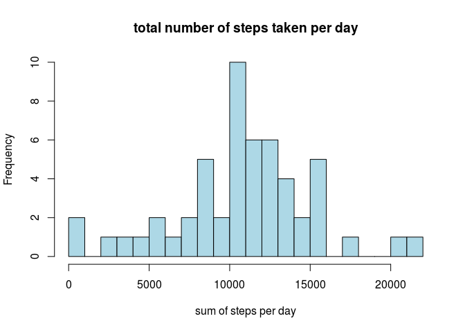
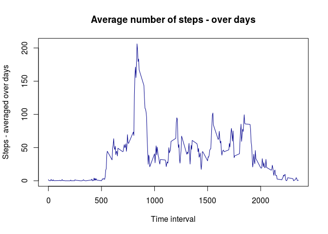
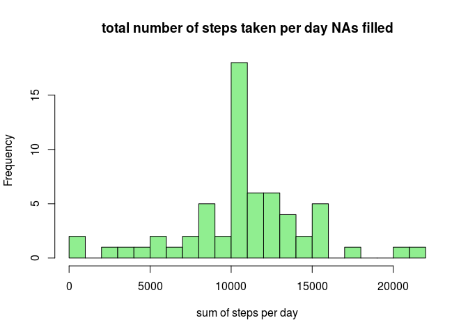
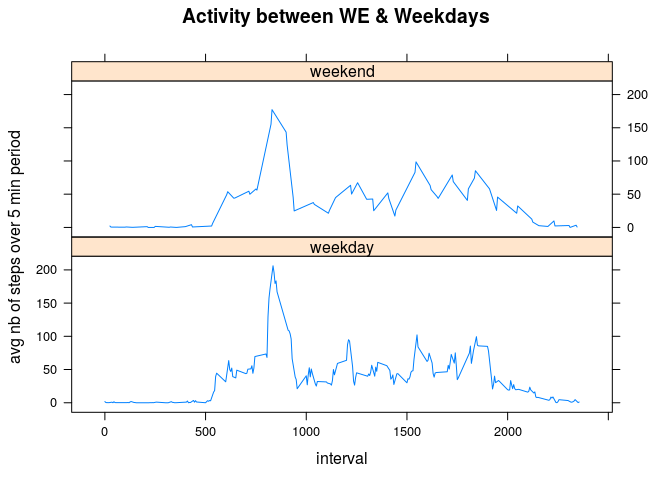

<br>
<br>
<br>


## Loading and preprocessing the data

#### Loading the data

```r
    ## Reading csv file
    activity <- read.csv("./data/activity.csv")
    ## Controlling Head & Tail of the dataset
    head(activity)
```

```
##   steps       date interval
## 1    NA 2012-10-01        0
## 2    NA 2012-10-01        5
## 3    NA 2012-10-01       10
## 4    NA 2012-10-01       15
## 5    NA 2012-10-01       20
## 6    NA 2012-10-01       25
```

```r
    tail(activity)
```

```
##       steps       date interval
## 17563    NA 2012-11-30     2330
## 17564    NA 2012-11-30     2335
## 17565    NA 2012-11-30     2340
## 17566    NA 2012-11-30     2345
## 17567    NA 2012-11-30     2350
## 17568    NA 2012-11-30     2355
```

The variables included in this dataset are:  

* **steps**: Number of steps taking in a 5-minute interval (missing
    values are coded as `NA`)

* **date**: The date on which the measurement was taken in YYYY-MM-DD
    format

* **interval**: Identifier for the 5-minute interval in which
    measurement was taken  

<br>

#### Converting "date" column to date format


```r
  activity$date <- as.Date(activity$date, format = "%Y-%m-%d")
```


<br>
<br>
<br>


## What is mean total number of steps taken per day?  

For this part of the assignment, the missing values of the dataset will be ignored  
The dplyr package will be used.  


#### Number of steps taken per day  

The histogram belows shows the distribution of steps taken per day.  
A number of bins (breaks) has been set to 20.  


```r
    # Building a pipe
    activity_sum_day <- activity %>% na.omit() %>%  group_by(date) %>% summarize(sum_steps =sum(steps))
    # Plotting histogram total nb of steps taken each day
    hist(activity_sum_day$sum_steps, breaks = 30, col="lightblue", main="total number of steps taken per day"
     ,xlab="sum of steps per day")
```

<!-- -->

#### Calculation of mean and median values per day  


```r
  mean_step_day = mean(activity_sum_day$sum_steps)
  median_step_day = median(activity_sum_day$sum_steps)
  # Printing the result
  paste("mean number of steps per day:",mean_step_day)
```

```
## [1] "mean number of steps per day: 10766.1886792453"
```

```r
  paste("median number of steps per day:",median_step_day)
```

```
## [1] "median number of steps per day: 10765"
```

<br>
<br>
<br>


## What is the average daily activity pattern?

Making time series plots of the 5 minutes intervals (x axis) and the average number of steps taken average of steps
taken, averages accross all days (y-axis)  


```r
  activity_avg_day <- activity %>% na.omit() %>%  group_by(interval) %>% summarize(avg_steps =mean(steps))
  plot(activity_avg_day$interval,activity_avg_day$avg_steps, type='l', col='darkblue'
     ,main="Average number of steps - over days", xlab="Time interval",ylab="Steps - averaged over days")
```

<!-- -->

Finding which 5-minute interval, on average across all the days in the dataset, contains the maximum number of steps?  


```r
  paste("5 min time interval with the highest nb of steps:", filter(activity_avg_day,avg_steps==max(avg_steps))[1])
```

```
## [1] "5 min time interval with the highest nb of steps: 835"
```

<br>
<br>
<br>


## Imputing missing values

Note that there are a number of days/intervals where there are missing values (coded as NA\color{red}{\verb|NA|}NA). The presence of missing days may introduce bias into some calculations or summaries of the data.  

Calculating the number of the total number of missing values in the dataset (NAs)  


```r
  paste("Nb of Missing Values in the dataset:",sum(is.na(activity)))
```

```
## [1] "Nb of Missing Values in the dataset: 2304"
```

The stategy retained for filling the missing values is to use the mean value of the 5 minutes interval
(read from the activity_avg_day dataframe)  


```r
  # Creating a new DF with values imputed to NAs
  activity_filled <- activity
  # Looping to replace NAs with the 5 min interval mean
  for (i in which(is.na(activity)))
    {
    activity_filled[i,]$steps <- (filter(activity_avg_day, interval==activity_filled[i,]$interval)$avg_steps)
    }
```

Checking if NAs are correctly removed


```r
  paste("Nb of Missing Values in the filled dataset:",sum(is.na(activity_filled)))
```

```
## [1] "Nb of Missing Values in the filled dataset: 0"
```
<br>

Make a histogram of the total number of steps taken each day and Calculate and report the mean and median total number of steps taken per day. Do these values differ from the estimates from the first part of the assignment? What is the impact of imputing missing data on the estimates of the total daily number of steps?  

<br>

#### Plotting the Histogram  


```r
    # Building a pipe
    activity_sum_day_fill <- activity_filled %>%  group_by(date) %>% summarize(sum_steps =sum(steps))
    # Plotting histogram total nb of steps taken each day
    hist(activity_sum_day_fill$sum_steps, breaks = 30, col="lightgreen", main="total number of steps taken per day NAs filled"
     ,xlab="sum of steps per day")  
```

<!-- -->

#### Computing mean & median for this new dataset  


```r
  mean_step_day_f = mean(activity_sum_day_fill$sum_steps)
  median_step_day_f = median(activity_sum_day_fill$sum_steps)
  # Printing the result
  paste("mean number of steps per day:",mean_step_day_f)
```

```
## [1] "mean number of steps per day: 10766.1886792453"
```

```r
  paste("median number of steps per day:",median_step_day_f)
```

```
## [1] "median number of steps per day: 10766.1886792453"
```

```r
  # Differences
  paste("Mean difference with dataset containing reoved NAs:",mean_step_day - mean_step_day_f)
```

```
## [1] "Mean difference with dataset containing reoved NAs: 0"
```

```r
  paste("Median difference with dataset containing reoved NAs:",median_step_day - median_step_day_f)
```

```
## [1] "Median difference with dataset containing reoved NAs: -1.1886792452824"
```

The difference is only on the median value not on the mean.  

<br>
<br>
<br>


## Are there differences in activity patterns between weekdays and weekends?

For this part the weekdays() function may be of some help here. Use the dataset with the filled-in missing values for this part.  

Create a new factor variable in the dataset with two levels – “weekday” and “weekend” indicating whether a given date is a weekday or weekend day.  

Make a panel plot containing a time series plot of the 5-minute interval (x-axis) and the average number of steps taken, averaged across all weekday days or weekend days (y-axis). See the README file in the GitHub repository to see an example of what this plot should look like using simulated data.  


```r
  #Factor variable - checking if day is WE (1= sunday / 7=Sat)
  library(lubridate)
```

```
## 
## Attaching package: 'lubridate'
```

```
## The following objects are masked from 'package:dplyr':
## 
##     intersect, setdiff, union
```

```
## The following objects are masked from 'package:base':
## 
##     date, intersect, setdiff, union
```

```r
  f<-(wday(activity_sum_day_fill$date) == 1) | (wday(activity_sum_day_fill$date) == 7)
  f<-factor(f,labels=c("weekday","weekend"))

  # Comparing patterns between WE & Weekdays
  library(lattice)
  xyplot(activity_avg_day$avg_steps ~ activity_avg_day$interval| f,
       layout=c(1,2),plot.points = FALSE,type = "l",ylab="avg nb of steps", xlab="interval", main="pattern comp between WE & Weekdays")
```

<!-- -->


