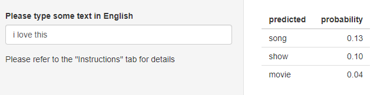

```{r setup, include=FALSE}
knitr::opts_chunk$set(echo = FALSE)
```

## Description of the algorithm  {.smaller}


This program uses a combination of Markov chain rule & stupid backoff approaches.
The algorithm was trained on samples (20%) of a set of 3 large text files : us_news, us_blogs and us_twitter.  
Bi-grams, 3-grams and 4-grams have been built from the dataset thanks to the tidytext package.  
<br/>  
**Building predictions**  
Frequency of words have been computed out of those n-grams : P(word_n|value of n-1 words).   
This basically means : based on the last words typed by the user (4,3,2 last words), what is the probability to have the next word being word_n ?  
As an initial attempt, considering the last 3 words typed by the user, the program tries to figure out if there is a match in its 4-grams database.  
If it exists, it returns 3 predictions for the next word by sorting results by considering highest probability.  
If no match is found, the program tries to find entries corresponding to 3-grams and switches to 2-grams if entries aren't found in the 3-grams database.  


## Instructions {.smaller}

This project concludes the Coursera Johns Hopkins' Data Science specilization.  
This Shiny application is used to predict the next word from a string typed by the user.  
Please note that this program only builds prediction in the English language.  
 

 

<br/>
The utilization of the application is straight forward : just type some text and check for predictions of the next word and its associated probability. 


## Technical issues faced during the project {.smaller}

I would say that most of the time spent on this project was related on how to find the best way to fit the large volume of training data to the limited memory available (8 Gb) on my computer.  
After several attempts (trying to read the complete dataset in a "one shot" approach), I finally manage to deal with memory limitations by building n-grams out of small random samples taken from the us_news, us_blog and us_twitter text files. 
In order to limit data stored in RAM, results coming out of those samples have been stored to a SQLite database.  
<br/>  
Compared to a native R-dataframe approach, the SQLite database has also contributed to speed up the execution of the prediction algorithm (giving data retrieval response time < 1 sec).  

 


## Personal considerations {.smaller}

I have to admit that like many students of this class, I wasn't understanding the interest of this project at the beginning.  
Considering that Natural Language Processing wasn't taught at all during the class, it appeared strange to me to dedicate so much efforts to something which, a priori, wasn't linked to the core content of the courses.  
<br/>  
After completing this project, I see things from a different perspective and I think I learned a lot.  
Having to deal with this new subject has encouraged me to learn new skills and to get support from the forums (Coursera, Stack overflow, R). Dealing with the memory limitations of the computer used to build the project gave me a taste of what Data Scientists' everyday life : finding workarounds and being patient !  
Thanks for your consideration.


